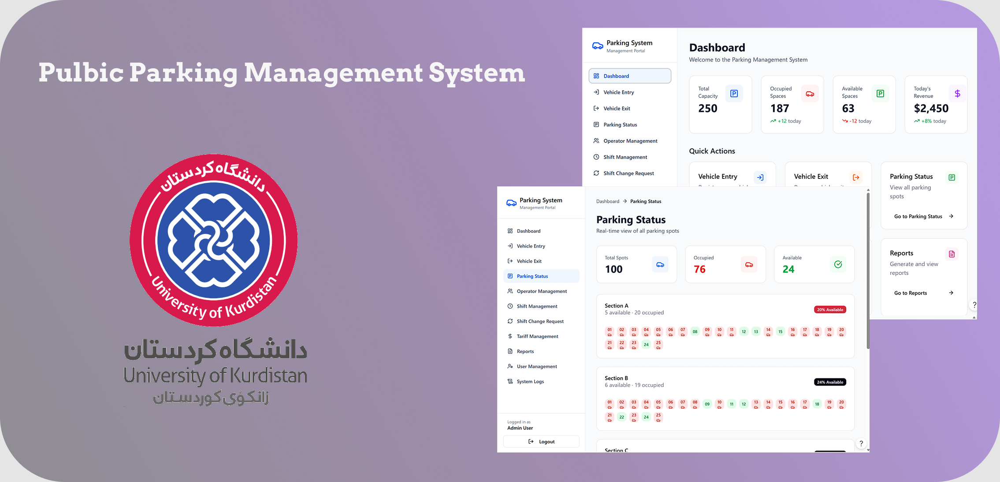

# UOK 404-405 Software Engineering: Public Parking Project

The following project was assigned to students during the second semester of 404-405 at [UOK](https://uok.ac.ir/), group 1 instructed by [Dr. Sadegh Sulaimany](https://research.uok.ac.ir/~ssulaimany/).

The project focuses on collaboration, AGILE methodolgy, and key software engineering concepts.

## Getting Started

These instructions will give you a copy of the project up and running on
your local machine for testing purposes.

### Prerequisites

The project is written using multiple web technologies and uses Electron for packaging the web-app into a local Windows application. For the best compatibility, make sure that your tools' versions matches the ones that the project was developed with.

Requirements for running the project are:

- [NPM](https://www.npmjs.com/)
- [React](https://react.dev/)
- [TypeScript](https://www.typescriptlang.org/)
- [Electron](https://www.electronjs.org/)

### Cloning the project

The next step is to store the project files on your machine. If you have `git` installed on your machine you can easily copy the repo:

    git clone https://hamgit.ir/software-engineering/parking-management-system.git --depth 1

**NOTE: this clones the latest version of each file on your machine. If you need the entire commit history, remove the `--depth 1` flag.**

If not, then you can download the source code in zip format by [clicking here](https://hamgit.ir/software-engineering/parking-management-system/-/archive/main/parking-management-system-main.zip?ref_type=heads).

Switch to the directory which houses the files:

    cd parking-management-system

You then need to install the additional requirements.

### Installing NPM

### Install dependencies

## Running the project

## Examples

## Built With

- [Contributor Covenant](https://www.contributor-covenant.org/) - Used for the Code of Conduct
- [Creative Commons](https://creativecommons.org/) - Used to choose the license

## Versioning

We use [Semantic Versioning](http://semver.org/) for versioning. For the versions
available, see the [tags on this
repository](https://github.com/PurpleBooth/a-good-readme-template/tags).

## Authors

- **Omid Ketabollahi** - [see profile](https://hamgit.ir/omid.ketabolahi2022/)
- **Mohammad Mozafari** - [see profile](https://hamgit.ir/mohamad.mozafari.12212)
- **Ahmad Mofti** - [see profile](https://hamgit.ir/ahmadmofti)

## License

This project is licensed under the [MIT License](LICENSE.md) - see the [LICENSE.md](LICENSE.md) file for details
