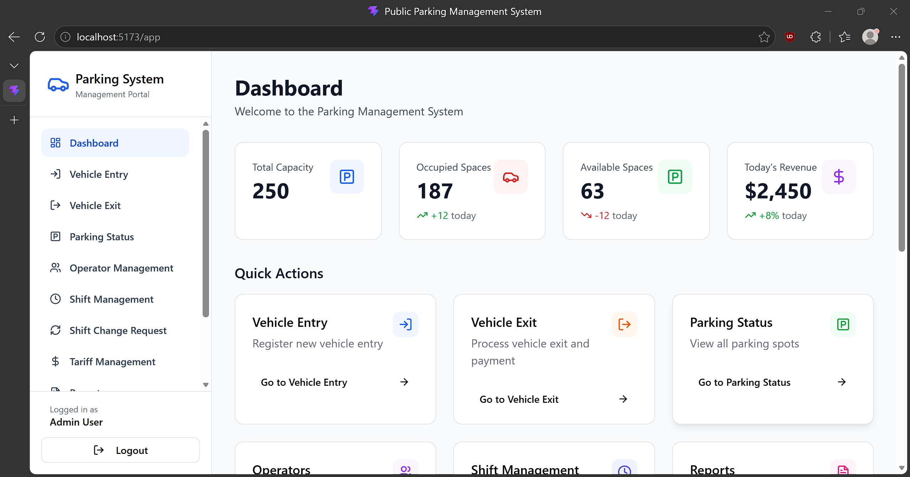

# UOK 404-405 Software Engineering: Public Parking Project

The following project was assigned to students during the second semester of 404-405 at [UOK](https://uok.ac.ir/), group 1 instructed by [Dr. Sadegh Sulaimany](https://research.uok.ac.ir/~ssulaimany/).


The project focuses on collaboration, AGILE methodolgy, and key software engineering concepts.

برای مطالعه نسخه فارسی فایل معرفی، بر روی لینک زیر کلیک کنید.

[Farsi README](/README_FA.md)

## Getting Started

These instructions will give you a copy of the project up and running on
your local machine for testing purposes.

If you are intereseted in merely running the program, a packaged windows application is also presented with the project. You can download the x64 exe package [here]()

### Prerequisites

The project is written using multiple web technologies and uses Electron for packaging the web-app into a local Windows application. For the best compatibility, make sure that your tools' versions matches the ones that the project was developed with.

Requirements for running the project are:

- [Node.js](https://nodejs.org/en)

Dependencies for the project are:

- [React](https://react.dev/)
- [Electron](https://www.electronjs.org/)

### Cloning the project

The next step is to store the project files on your machine. If you have `git` installed on your machine you can easily copy the repo:

    git clone https://hamgit.ir/software-engineering/parking-management-system.git --depth 1

**NOTE: this clones the latest version of each file on your machine. If you need the entire commit history, remove the `--depth 1` flag.**

If not, then you can download the source code in zip format by [clicking here](https://hamgit.ir/software-engineering/parking-management-system/-/archive/main/parking-management-system-main.zip?ref_type=heads).

Switch to the directory which houses the files:

    cd parking-management-system

You then need to install the additional requirements.

### Installing Nodejs

Instructions for installing nodejs differ from OS to OS and from architecture to architecture. Follow the official nodejs help  to see a tutorial based on your needs.

[Download Nodejs](https://nodejs.org/en/download)

### Install dependencies

After setting up node.js on your machine, the next step is to install the project dependencies. To do so make sure you are in the project root. Then run:

  ```
  npm install
  ```
  or:
  ```
  npm ci
  ```

to install the dependencies. This may take a while. After this, you can now run the projct

## Running the project

To run the project, make sure you are in the project's root directory then execute:

  ```
  npm start
  ```

You should see an output like:

  ```
  OTHER_DIRECTORY/parking-management-system$ npm start

    > parking-management-system@1.0.0 start
    > vite

    The CJS build of Vite's Node API is deprecated. See https://vite.dev/guide/troubleshooting.html#vite-cjs-node-api-deprecated for more details.

    VITE v5.4.21  ready in 383 ms

    ➜  Local:   http://localhost:5173/
    ➜  Network: use --host to expose
    ➜  press h + enter to show help

  ```

You can now access the project through your web browser by going to the URL displayed in the output. In this case: ```http://localhost:5173/```



If you prefer to run the project in application mode, then while **the localhost is up and running, in another terminal session,** run the command:

  ```
  npm run electron
  ```

This will display the project as a local app.

## User Manual

We have compiled a thorough and rigorous guide to introduce our users to the given software and familiarize them with what the project has to offer.

[Click here]() to be redirected to the User Manual.

## FAQ

We have compiled a handful of **Frequently Asked Questions** one might ask when using the software.

[Click here]() to be redirected to our FAQ.

## Built With

- [Contributor Covenant](https://www.contributor-covenant.org/) - Used for the Code of Conduct
- [Creative Commons](https://creativecommons.org/) - Used to choose the license

## Versioning

We use [Semantic Versioning](http://semver.org/) for versioning. For the versions
available, see the [tags on this
repository](https://github.com/PurpleBooth/a-good-readme-template/tags).

## Authors

- **Omid Ketabollahi** - [see profile](https://hamgit.ir/omid.ketabolahi2022/)
- **Mohammad Mozafari** - [see profile](https://hamgit.ir/mohamad.mozafari.12212)
- **Ahmad Mofti** - [see profile](https://hamgit.ir/ahmadmofti)

## License

This project is licensed under the [MIT License](LICENSE.md) - see the [LICENSE.md](LICENSE.md) file for details
